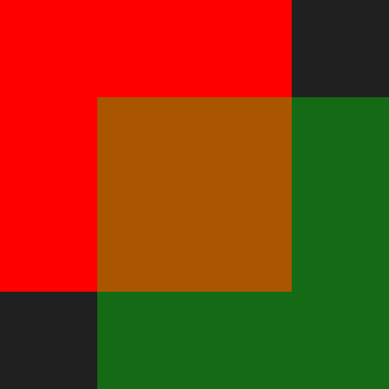

# From the one and only...

# Examples
### Chessboard

### Triangle

### Circle

### Lines

### Alpha blending into PPM format

### Drawing with lines

Original olive.c: https://github.com/tsoding/olive.c
